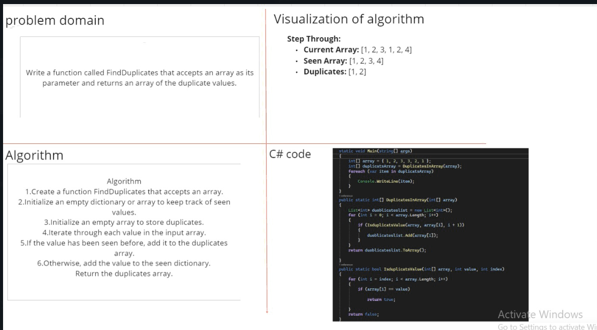

-The method loop through the array and get 1 value then send it to another method 
to check the duplicate through another loop if it is duplicate the method return true 
then in the first method saved in list an so on , finally it convert the list to an array 
then return it and send it to print method to print all duplicate values 