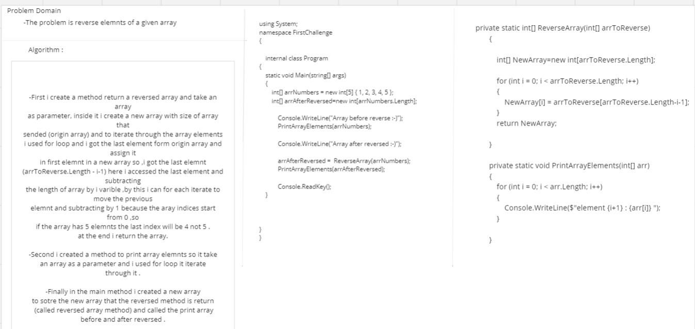
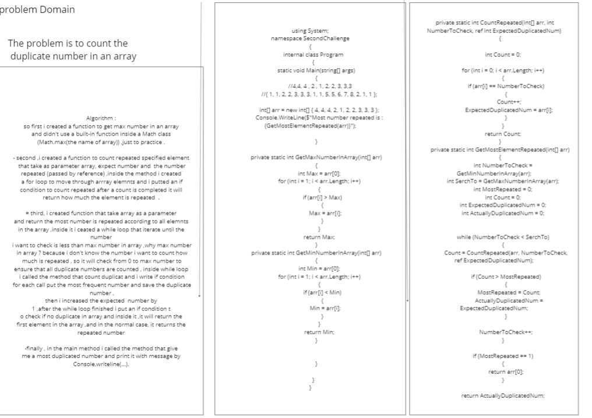
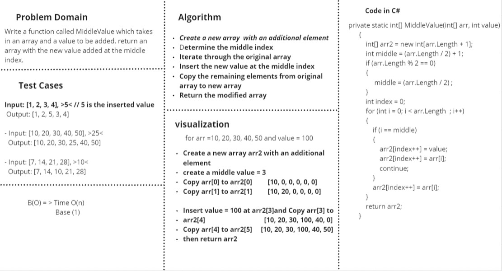
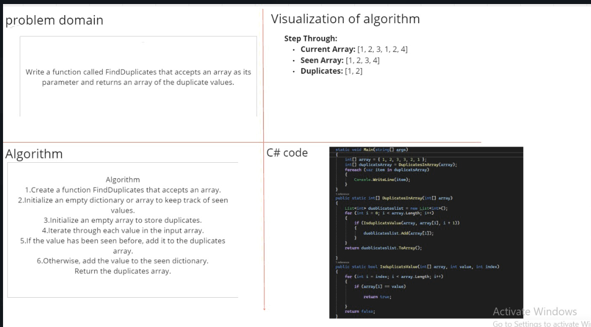
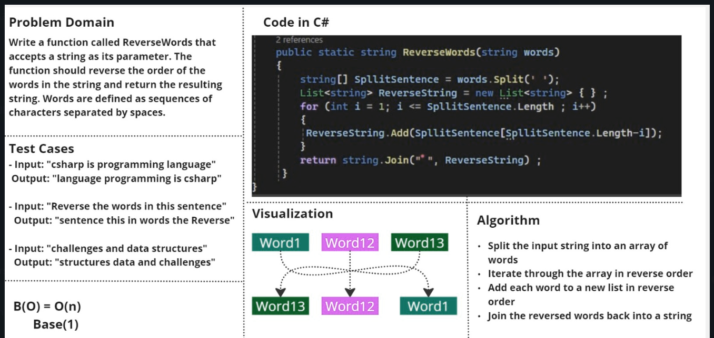
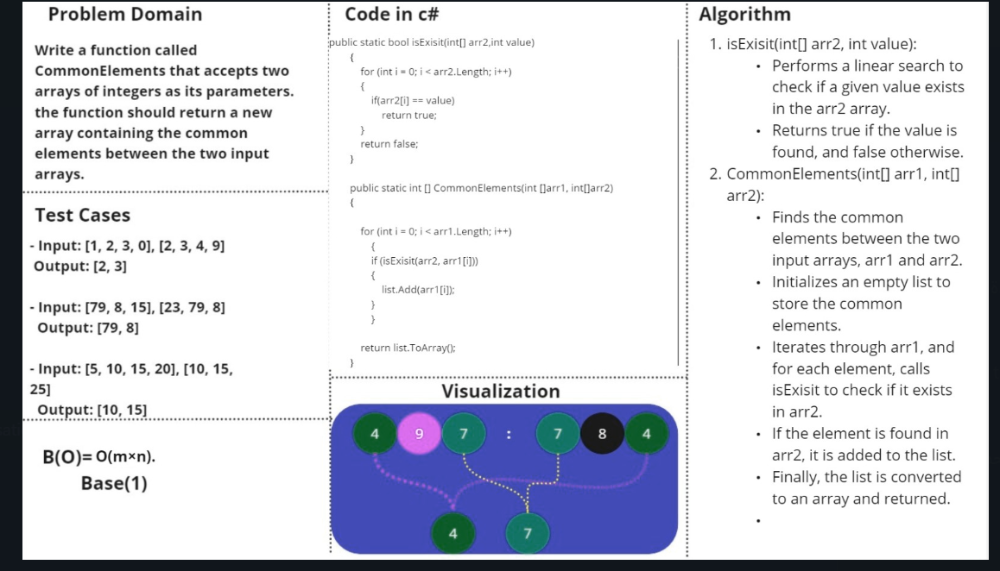

# challengDataStructure

whiteboard challenge 

.png)
.png)

---

# Linked List

[Linked_List](./DataStructure/LinkedList/LinkedList/README.md)

---

# Linked List Remove Duplicate

[Linked_List Remove Duplicate](./DataStructure/LinkedList/LinkedList/Dublicate/README.md)

---

# Merge Sorted Linked List

[Linked_List Merge Sorted](./DataStructure/LinkedList/LinkedList/MergeSorted/README.md)

---
# Stack & Queue

[Stack & Queue](./DataStructure/StackAndQueue/StackAndQueue/StackAndQueue/READEME.md)

---
# Reverse Stack Using Queue

[Reverse Stack Using Queue](./DataStructure/StackAndQueue/StackAndQueue/StackAndQueue/StackReverseUsingQueue/READEME.md)

---
# Remove Middle Element in the Stack 

[Remove Middle Element in the Stack ](./DataStructure/StackAndQueue/StackAndQueue/StackAndQueue/DeleteMiddleElement/README.md)

---

# Min Stack

[Min Stack ](./DataStructure/StackAndQueue/StackAndQueue/StackAndQueue/MinStack/README.md)

---

# BT_BST

[BT_BST ](./DataStructure/Trees/TreeImplementation/TreeImplementation/READEME.md)

